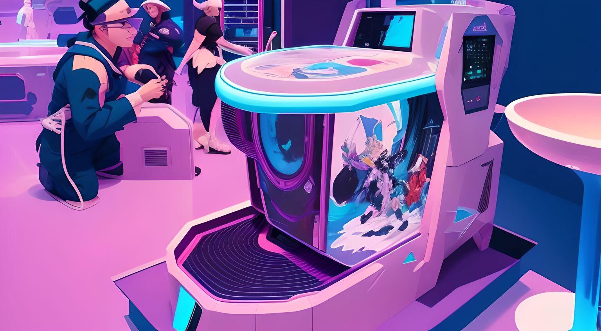
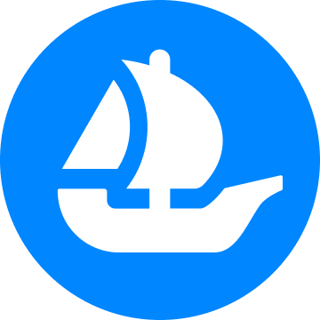
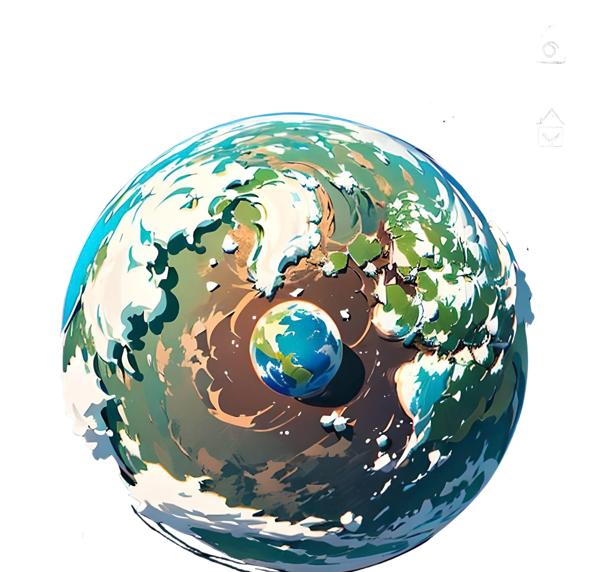

  

<h1 align="center">𝓬𝓸𝓝𝓕𝓣𝓮𝓮.𝓲𝓸</h1>

  <strong>A multi-platform Web3 explorer for NFT collections, domains, and live radio — all in one place.</strong>

  <a href="https://conftee.io">🌐 Live Site</a> · 
  <a href="#features">✨ Features</a>

---

## Overview

**coNFTee** is a Web3 content explorer that aggregates NFT collections, Unstoppable Domains, OpenSea analytics, and a global live radio player into a single, beautifully designed interface. Built with performance and accessibility in mind, it supports 15+ languages and works across all devices.

## 🌍 Languages (+16)

  🇬🇧 English · 🇪🇸 Español · 🏴 Català · 🇫🇷 Français · 🇩🇪 Deutsch · 🇵🇹 Português · 🇯🇵 日本語 · 🇨🇳 中文 · 🇮🇳 हिन्दी · 🇸🇦 العربية · 🇷🇺 Русский · 🇧🇩 বাংলা · 🇮🇩 Bahasa · 🇹🇭 ไทย · 🇰🇪 Kiswahili · 🇵🇰 اردو

# Features

### 💎 New Minting System Secured by PokeMetaX.io
- Direct Integration: Full access to the PokeMetaX.io ecosystem for seamless minting of new digital assets.
- Custom Generation: Optimized system for real-time creation, deployment, minting, and listing of NFT collections.
- Metadata Management: Automated handling of metadata and securely hosted media assets.

###  +900k NFT - (Polygon) 
- Browse curated NFT collections including Pokémon, CryptoPunks, Bored Apes, Azuki, Doodles, and more
- View individual NFTs with full metadata, descriptions, and OpenSea links
- Category-based filtering and search
- Cached collection data for fast loading

###  Real Time OpenSea Analytics
- Real-time OpenSea listed and sold
- Collection analysis with contract inspection
- Wallet analysis and portfolio overview

###  +200k Unstoppable Domains
- Browse and explore Web3 domains (.crypto, .x, .wallet, .nft, .blockchain, etc.)
- Premium domain discovery with keyword filtering
- ICANN 2026 badge indicators
- Domain ownership verification

###  Live Radio
- Global radio player with 30,000+ stations worldwide
- Interactive 3D globe visualization for station discovery
- Persistent player across all pages
- Genre and country-based browsing

### 🔗 Web3 Integration
- MetaMask and WalletConnect support via RainbowKit
- ENS and Unstoppable Domains name resolution
- On-chain domain verification

---

## 📬 Contact

| | |
|---|---|
| **General** | [contact@conftee.xyz](mailto:contact@conftee.io) |
| **Jobs** | [jobs@conftee.xyz](mailto:jobs@conftee.io) |

---

  Built with ❤️ by <a href="https://ud.me/doctor.bitcoin">doctor.bitcoin</a>

